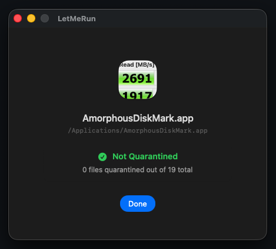
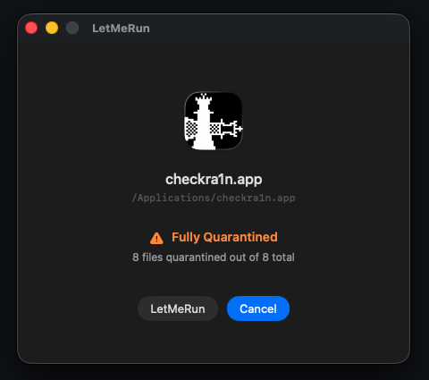

# LetMeRun

A simple macOS drag-and-drop utility to remove the `com.apple.quarantine` flag from files and apps. 

  
  &nbsp;
  

## What it does

macOS flags downloaded files with `com.apple.quarantine`, which blocks unverified apps from running. You can drag any file, folder, or app into LetMeRun to check its quarantine status and remove the flag instantly so you can run it. 

- Drag and drop any file, folder, or app
- Scans folders recursively to show exactly how many files are blocked
- Removes quarantine attributes instantly using native macOS tools

## Build & Run

1. Open `LetMeRun.xcodeproj` in Xcode 15+
2. Build and run (Cmd + R)

## License

MIT License
